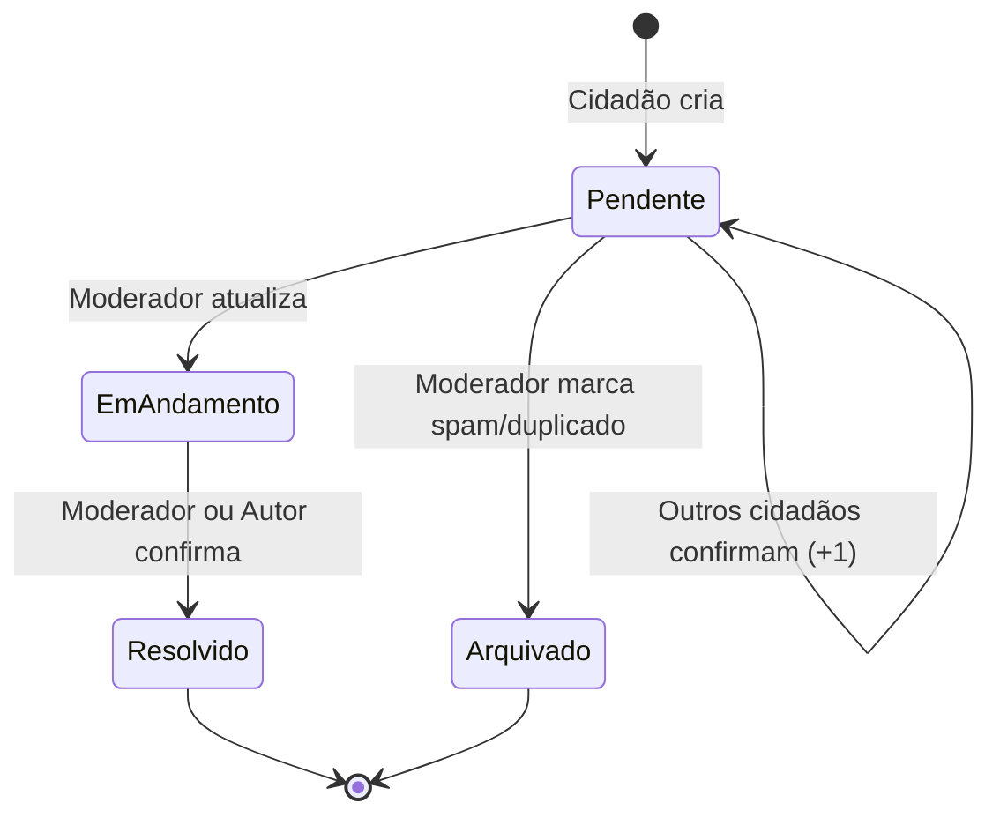

# 🏗️ JacaMap — Regras de Negócio

## 1. Diagnóstico do Estado Atual

### O que funciona
- ✅ Mapa com denúncias em tempo real (stream Firestore)
- ✅ Cadastro e login de usuários (e-mail + anônimo)
- ✅ Criação de denúncias com categoria, gravidade, descrição e localização
- ✅ Filtros por categoria, gravidade e status
- ✅ Visualização de detalhes de cada denúncia
- ✅ Tema dark premium com glassmorphism no login

### O que está quebrado / não faz sentido

| Problema | Impacto | Gravidade |
|---|---|---|
| **Qualquer usuário logado pode mudar o status de qualquer denúncia** | Um cidadão comum pode marcar "Resolvido" algo que não foi. Ou um troll pode reverter tudo para "Pendente". | 🔴 Crítico |
| **Sem sistema de confirmação** | 10 pessoas reportam o mesmo buraco → 10 marcadores no mapa. Poluição visual total. | 🔴 Crítico |
| **Sem proteção contra spam** | Um usuário pode criar 100 denúncias falsas em 1 minuto. | 🟠 Alto |
| **Sem vínculo autor↔denúncia** | Não mostra quem reportou. Ninguém sabe se o report é confiável. | 🟠 Alto |
| **Sem feedback ao autor** | O cidadão reporta, mas nunca sabe se alguém viu ou fez algo. | 🟡 Médio |
| **Upload de foto removido** | Sem evidência visual — mas OK para o MVP sem imagem. | 🟡 Médio |
| **Sem limites geográficos** | Alguém pode reportar um problema em Tóquio. O app é para Jacareí. | 🟡 Médio |

---

## 2. Papéis de Usuário Propostos

```
┌─────────────────────────────────────────────────┐
│                  PAPÉIS                         │
├──────────────┬──────────────┬───────────────────┤
│  👁️ Visitante │  👤 Cidadão   │  🛡️ Moderador     │
│  (anônimo)   │  (logado)    │  (logado + flag)  │
├──────────────┼──────────────┼───────────────────┤
│ Ver mapa     │ Tudo do      │ Tudo do Cidadão   │
│ Ver denúncias│ Visitante +  │ + Mudar status    │
│ Filtrar      │ Criar report │ + Arquivar        │
│              │ Confirmar    │ + Marcar spam      │
│              │ report alheio│                   │
└──────────────┴──────────────┴───────────────────┘
```

### 👁️ Visitante (anônimo)
- Entra no app sem cadastro
- **Pode:** ver o mapa, ver todas as denúncias, usar os filtros
- **NÃO pode:** criar denúncias, confirmar, ou alterar qualquer coisa
- **Motivo:** incentiva o cadastro e evita abuso

### 👤 Cidadão (cadastrado)
- Tem e-mail e senha
- **Pode:** tudo do visitante + criar denúncias + confirmar denúncias de outros
- **NÃO pode:** mudar o status de denúncias alheias
- **Pode:** mudar o status apenas de suas próprias denúncias (ex: "já resolveram!")
- **Limite:** máximo de **5 denúncias por dia** (anti-spam)

### 🛡️ Moderador (admin)
- Cidadão com flag `role: 'moderador'` no Firestore
- **Pode:** tudo do cidadão + alterar status de qualquer denúncia + arquivar spam
- **Para o hackathon:** pode ser hardcoded (ex: uma lista de UIDs admin)

---

## 3. Ciclo de Vida da Denúncia



### Status possíveis

| Status | Significado | Quem muda para cá |
|---|---|---|
| `Pendente` | Recém-criada, aguardando ação | Automático na criação |
| `Em andamento` | Alguém está cuidando | Moderador |
| `Resolvido` | Problema corrigido | Moderador ou o próprio Autor |
| `Arquivado` | Spam, duplicado ou inválido | Moderador |

---

## 4. Sistema de Confirmação ("+1 Eu Também")

> **Problema atual:** Se 10 moradores veem o mesmo buraco, criam 10 denúncias separadas. Isso polui o mapa e não transmite urgência.

### Proposta: botão "Confirmar" (tipo upvote)

- Ao ver uma denúncia no mapa, o cidadão logado pode clicar em **"Eu também"**
- Isso incrementa um **contador de confirmações** (`confirmacoes: 3`)
- Armazena a lista de UIDs que confirmaram (para evitar voto duplo)
- **Efeito visual:** denúncias com mais confirmações ficam com marcador **MAIOR** ou com um badge numérico

### Benefícios
1. Evita duplicatas — "já tem um report disso, só confirma"
2. Mostra ao moderador/prefeitura o que é mais urgente
3. Incentiva engajamento sem criar mais lixo no banco

### Campos novos no Firestore

```
denuncias/{id}
  ├── ...campos existentes...
  ├── confirmacoes    : int       (default: 0)
  ├── confirmadoPor   : string[]  (lista de UIDs)
  └── arquivado       : bool      (default: false)
```

---

## 5. Regras de Criação de Denúncia

### Obrigatório
| Campo | Regra |
|---|---|
| Categoria | Deve selecionar uma das opções fixas |
| Descrição | Mínimo 10 caracteres, máximo 500 |
| Localização | Captura automática pela mira do mapa |
| Gravidade | Selecionar Baixa / Média / Alta |

### Restrições
| Regra | Motivo |
|---|---|
| **Máximo 5 denúncias por dia** por usuário | Anti-spam |
| **Raio de Jacareí** (~15km do centro) | Evita reports fora da cidade |
| **Distância mínima de 50m** de denúncia existente da mesma categoria | Sugere confirmar a existente em vez de criar nova |

### Fluxo de criação (com anti-duplicata)

```
Cidadão clica "REPORTAR"
    │
    ├── Está logado? ──► NÃO → Abre pop-up de login
    │
    ├── SIM
    │   ├── Já criou 5 hoje? → Snackbar: "Limite diário atingido"
    │   │
    │   ├── Existe denúncia semelhante em ~50m?
    │   │   └── SIM → Sugere: "Já existe um report próximo.
    │   │              Deseja confirmar (+1) ou criar um novo?"
    │   │
    │   └── NÃO → Abre modal de criação normal
    │
    └── Salva no Firestore com status "Pendente"
```

---

## 6. Regras de Visualização

### Marcadores no mapa
| Critério visual | Significado |
|---|---|
| **Cor** por status | 🔴 Pendente, 🟡 Em andamento, 🟢 Resolvido |
| **Ícone** por categoria | 🕳️ Buraco, 💡 Iluminação, 🗑️ Lixo, etc. |
| **Tamanho** por confirmações | 0-2 = pequeno, 3-5 = médio, 6+ = grande |
| **Opacidade** para resolvidos | Marcadores resolvidos ficam semi-transparentes |
| **Ocultar** arquivados | Não aparecem no mapa |

### Sheet de detalhes
Ao tocar num marcador, mostrar:
- Categoria + Gravidade
- Status atual (com cor)
- Descrição
- Data/hora do report
- **Quantas confirmações** ("3 moradores confirmaram")
- Botão "Eu também" (se logado e ainda não confirmou)
- Botão "Atualizar Status" (se moderador ou autor)

---

## 7. Regras de Permissão — Resumo

| Ação | Visitante | Cidadão | Moderador |
|---|---|---|---|
| Ver mapa e denúncias | ✅ | ✅ | ✅ |
| Filtrar denúncias | ✅ | ✅ | ✅ |
| Criar denúncia | ❌ | ✅ (max 5/dia) | ✅ |
| Confirmar denúncia (+1) | ❌ | ✅ (1x por report) | ✅ |
| Mudar status da **própria** denúncia | ❌ | ✅ (apenas → Resolvido) | ✅ |
| Mudar status de **qualquer** denúncia | ❌ | ❌ | ✅ |
| Arquivar denúncia (spam) | ❌ | ❌ | ✅ |

---

## 8. Modelo de Dados Atualizado

```
denuncias/{id}
  ├── categoria       : string     # "Buraco na Via"
  ├── descricao       : string     # "Buraco enorme na Rua XV"
  ├── latitude        : double
  ├── longitude       : double
  ├── status          : string     # "Pendente" | "Em andamento" | "Resolvido" | "Arquivado"
  ├── gravidade       : string     # "Baixa" | "Média" | "Alta"
  ├── userId          : string     # UID do autor
  ├── confirmacoes    : int        # Número de "+1 eu também"
  ├── confirmadoPor   : string[]   # UIDs de quem confirmou
  ├── arquivado       : bool       # true = spam/duplicado
  ├── timestamp       : timestamp  # Data de criação
  └── updatedAt       : timestamp  # Última atualização de status

users/{uid}  (novo — opcional)
  ├── email           : string
  ├── role            : string     # "cidadao" | "moderador"
  ├── reportsDiarios  : int        # Contador reset diário
  └── ultimoReport    : timestamp  # Para controle de rate-limit
```

---

## 9. O que implementar para o Hackathon (MVP Prático)

> [!IMPORTANT]
> O hackathon tem tempo limitado. Abaixo está a priorização do que torna o app **funcional e com sentido**, ordenado por impacto.

### 🔴 Prioridade 1 — Obrigatório
1. **Restringir "Atualizar Status"** — só o autor da denúncia ou moderador
2. **Remover foto** — já decidido, simplificar o modal
3. **Adicionar campo `confirmacoes`** — contador simples no Firestore
4. **Botão "Eu também"** no detalhe — incrementa confirmações

### 🟠 Prioridade 2 — Importante
5. **Limite de 5 reports/dia** — campo no Firestore + verificação
6. **Detecção de proximidade** — ao criar, avisar se já existe report próximo (~50m)
7. **Mostrar quantidade de confirmações** no detalhe e no marcador

### 🟡 Prioridade 3 — Desejável
8. **Sistema de moderador** — flag no Firestore, hardcoded por UID
9. **Ocultar denúncias resolvidas** — toggle ou opacidade reduzida
10. **Validação de raio** — verificar se a localização está dentro de Jacareí

---

## 10. Ideias Extras para Apresentação

| Ideia | Impacto na demo |
|---|---|
| **"Calor" no mapa** — regiões com mais denúncias ficam com halo colorido | Impressiona visualmente |
| **Ranking do bairro** — "Zona Norte: 12 pendentes" | Mostra inteligência |
| **Notificação local** — quando o status da sua denúncia muda | Mostra compromisso com o cidadão |
| **Modo offline** — cache local das denúncias para áreas sem sinal | Diferencial técnico |
| **Compartilhar denúncia** — gerar link deep-link para WhatsApp | Viralização orgânica |
